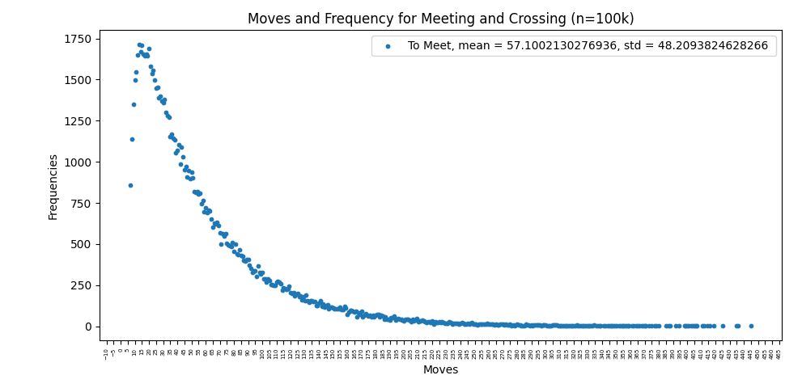
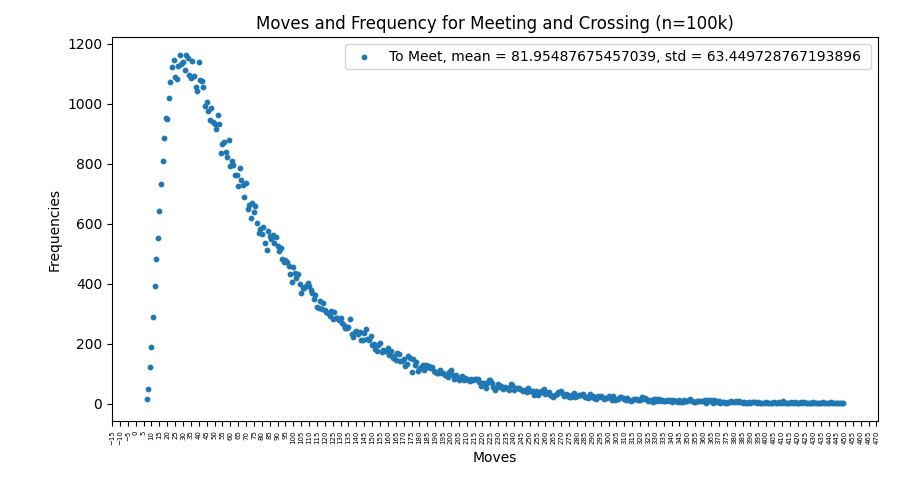
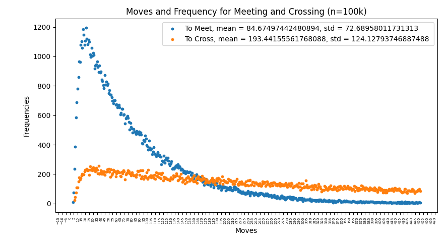
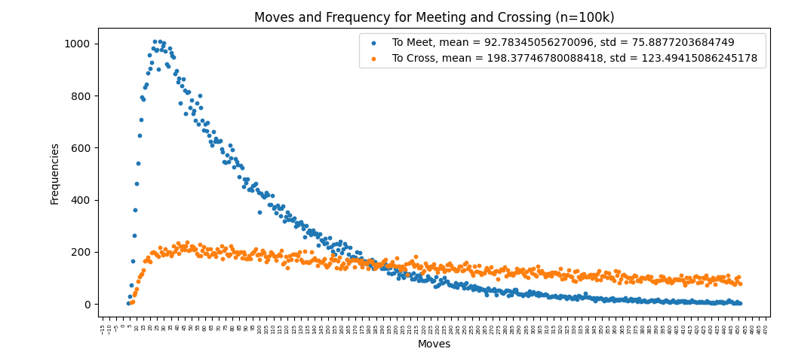

# AntsGame
A multithreaded simulation with plots to answer a probability Ant movement game. 

It aims to solve this prompt: 

Two ants start in opposite corners of a regular chessboard. Every 10 seconds, they move from the center of the square they're on to the center of an adjacent square. How long until they both land on the same square? How long until their paths cross (Ant A moving from square K to L and Ant B moving from square L to K)? What happens if we allow the ants to move diagonally? What happens if we restrict ants from moving to their immediately previous square?

All of the situations will be explored in order with data. My initial thoughts rely on the fact that due to the boundaries of the chessboard, the ants are more likely to move closer together rather than further apart. This is true until they are very close or have met / crossed. In addition, I have understood the 'crossing' of the ants as if they swap positions in a single turn. Furthermore, the timing of 10s has been disregarded and the unit of 'moves' has been used instead.

<i>Note: Ants meeting is defined as Ant_A.position == Ant_B.position, position --> int x, int y. Ants crossing is defined as Ant_A.previousPosition == Ant_B.Position AND Ant_A.Position == Ant_B.PreviousPosition</i>

<h3> No backtracking and No diagonal movement </h3>

This is the most simple scenario in the sense that the set of moves possible for each ant is reduced to at most 3. In addition to this, the only way for the ant to move in an opposite direction than previously is for it to move in a circular fashion. Since it now requires a <b>sequence</b> of moves to traverse backwards, this makes it more unlikely. Therefore the ant has an overall higher chance to move into 'new' areas and traverse forwards. Since the Ants begin in opposite directons, this means they are most likely to meet.
Also, due to the lack of diagonal movement and even dimensions of the board, it is impossible for the Ants movement's to cross.
The data below captures this:

This data is left-skewed with the majority of meetings happening before 57 moves. The mean and standard deviation are shown but since the set of all outcomes has a lower limit of 7 moves, the mean is shifted up, the number of moves has been capped at 450. The modal number of moves is around 17 moves.

<h3> Backtracking with No diagonal movement </h3>

This scenario is the same as the previous one except now the ants have 4 possible moves which includes being able to return back to their previous position. An immediate analysis is that this means there is an increased likelihood for the Ants to 'never' meet or in this case exceed 450 moves.

<h3> No backtracking with diagonal movement </h3>

This scenario allows the Ants to cross and also increases the set of possible moves for the Ants. 

Since Diagonal movement is allowed, the minimum required moves has reduced to 4. However, this is rare since both Ants must choose the same (opposite) move 4 times in a row.
The modal values are similar in this scenario and also between the crossing and meeting objectives. The standard deviation for the crossing is much larger and it is shown since the data is more spread out. The positive skew still remains. 

<h3> Backtracking and Diagonal Movement </h3>
In this scenario, the set of moves is maximised at 8 directions.

Likely due to the increased set of moves, the mean number of moves to meet and cross has increased. The modal values have also slightly increased to 30. However, the basic shape of both lines remain in being a positively skewed distrubution. 

<h2>Conclusion and thoughts</h2>
All in all, this problem presents a set of scenarios for which I believe there is no analytical solution. Due to this, a simulation approach where the rules of the scenario are translated accurately into control logic for the program is warranted. Before simulation, initial analysis hints at a distrubution as shown, but without comprehensive proof or results, it is unreliable. In order to improve my simulation and findings, there are a number of things I could do.
<h4> Increasing the simulation count</h4> 

 If compute resources and time were not an issue, increasing the simulation count would remove outliers and increase the consistency of the results. This is essential for stochastic problems such as this.
 </li>
<h4> Randomness of the movement </h4>

 When dealing with scenarios like this, the randomness of the movement choice is integral for accuracy. This is an issue since the randomness available in programming is not truly random and will exhibit some level of pattern like behaviour. This will inevitably skew any data collected, so one objective is to minimise this. 

